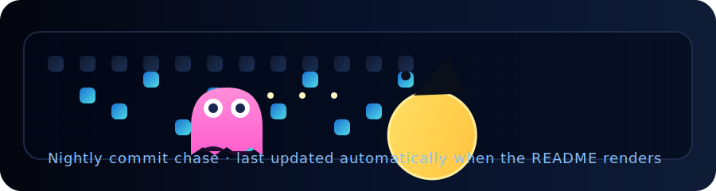

  <h1 align="center" style="margin:0 0 8px 0;">Aman Mohamed</h1>
  
<strong>Aspiring Software Engineer · SaaS Product Builder · Full-Stack & Backend Developer</strong>

  
Colombo, Sri Lanka · Open to internships, contract, and remote opportunities

  

    
    
    
    
    
  

  

    
    
    
    
  

<h2 align="left">Hi 👋! My name is Aman Mohamed and I'm a SaaS-focused software engineer in training from Colombo, Sri Lanka.</h2>

###

  

  

  

  
  

### 🎮 Stack Loadout

The toolkit I keep hot-keyed for SaaS builds, control panels, and backend boss fights.

  

  
  
  
  
  
  

  
  
  
  
  
  

###

  
  
  
  
  

###

 

---

## 👋 About Me

  
I’m a SLIIT BSc. (Software Engineering) undergraduate obsessed with crafting SaaS products that feel polished, reliable, and genuinely helpful. I love taking ideas from messy notes to production-ready experiences—balancing product thinking, research, and the engineering required to scale.

  

    

      🧠
      

        <strong>Product Researcher</strong>
        
Onboarding, retention, and sustainable growth loops.

      

    

    

      🛠️
      

        <strong>Full-Stack Engineer</strong>
        
Go backends, MERN/Next.js frontends, NestJS-powered APIs.

      

    

    

      ⚙️
      

        <strong>Security & Systems</strong>
        
Designing RBAC, MFA, observability, and clean auth flows.

      

    

    

      🤝
      

        <strong>Builder Mindset</strong>
        
Open to internships, collaborations, and impactful volunteer work.

      

    

  

---

## 🚀 What I’m Building

  

    

      <h4 style="margin:0;">INQ Admin Platform</h4>
      50% · Alpha
    

    
Enterprise-grade Super Admin/Admin system with MFA, granular permissions, detailed audit trails, and secure onboarding flows.

    
Stack: Node.js · NestJS · MongoDB · MFA

  

  

    

      <h4 style="margin:0;">Portfolio v2</h4>
      Live
    

    
Next.js 15 + TypeScript rebuild with shadcn/ui, Framer Motion micro-interactions, typed content models, and Vercel CI/CD.

    
Stack: Next.js · TypeScript · Tailwind · shadcn/ui

  

  

    

      <h4 style="margin:0;">GymHub (MERN + Stripe)</h4>
      Pilot
    

    
Centralized gym platform with JWT auth, trainer onboarding, analytics dashboards, and subscription billing via Stripe.

    
Stack: MongoDB · Express · React · Node · Stripe

  

  

    

      <h4 style="margin:0;">WalletWhiz (Kotlin)</h4>
      Android
    

    
Native finance companion covering budgets, goal tracking, MPAndroidChart insights, coroutine-powered storage, and alerts.

    
Stack: Kotlin · Android SDK · Jetpack · MPAndroidChart

  

---

## 🧰 Tech Focus

  

    <h4 style="margin-top:0;display:flex;align-items:center;gap:8px;">💡Programming & Languages</h4>
    

      Go
      TypeScript
      JavaScript
      Java
      Kotlin
      Python
      C/C++
    

  

  

    <h4 style="margin-top:0;display:flex;align-items:center;gap:8px;">🧩Frameworks & Platforms</h4>
    

      Next.js
      React
      NestJS
      Express
      Android Jetpack
      Tailwind
      shadcn/ui
    

  

  

    <h4 style="margin-top:0;display:flex;align-items:center;gap:8px;">⚙️Backend & DevOps</h4>
    

      Go services
      Node.js
      JWT / RBAC / MFA
      REST API design
      Audit logging
      Rate limiting
      CI/CD
    

  

  

    <h4 style="margin-top:0;display:flex;align-items:center;gap:8px;">🗄️Data & Storage</h4>
    

      MongoDB
      MySQL
      PostgreSQL
      NoSQL modeling
      Redis caching
      DB observability
    

  

  

    <h4 style="margin-top:0;display:flex;align-items:center;gap:8px;">🚢Product & Delivery</h4>
    

      Product research
      Project management
      Agile / SDLC
      UX storytelling
      Documentation
    

  

---

## 🏫 Education

  

    
    <h4 style="margin:0;">SLIIT — BSc. (Hons) in Software Engineering</h4>
    
May 2023 – Aug 2027 · 3rd year · Basketball & Football · GPA tracking toward graduation.

  

  

    
    <h4 style="margin:0;">Zahira College Mawanella</h4>
    
STEM foundation, leadership, and club activities that kick-started the engineering journey.

  

---

## 🗂 Spotlight Projects

  

    <h4 style="margin-top:0;">INQ Admin Suite</h4>
    
Node.js · NestJS · MongoDB · MFA

    
Hierarchical RBAC, MFA-enforced Super Admin flows, permission versioning, and audit-ready logging.

  

  

    <h4 style="margin-top:0;">Portfolio v2</h4>
    
Next.js 15 · TypeScript · Tailwind · shadcn/ui

    
Motion-driven UI, typed content models, serverless email, Vercel deployments, and evolving blog/experiments.

  

  

    <h4 style="margin-top:0;">GymHub Platform</h4>
    
MERN · Stripe · JWT

    
Multi-tenant gym management, trainer hiring, subscription billing, and real-time analytics dashboards.

  

  

    <h4 style="margin-top:0;">WalletWhiz</h4>
    
Kotlin · Android SDK · Jetpack

    
Expense tracking, goal-based budgeting, MPAndroidChart insights, coroutine persistence, and smooth onboarding.

  

---

## 📊 GitHub Snapshot

  

  

### Night Ops Scorecard

  

    <h4 style="margin-top:0;margin-bottom:18px;color:#8cc3ff;">Aman Mohamed Jh&apos;s GitHub Stats</h4>
    

      <ul style="list-style:none;margin:0;padding:0;font-size:0.95rem;">
        <li style="margin-bottom:6px;">⭐ <strong>Total Stars:</strong> 0</li>
        <li style="margin-bottom:6px;">🕒 <strong>Total Commits:</strong> 715</li>
        <li style="margin-bottom:6px;">🔗 <strong>Total PRs:</strong> 56</li>
        <li style="margin-bottom:6px;">❗ <strong>Total Issues:</strong> 0</li>
        <li>📦 <strong>Contributed to:</strong> 2</li>
      </ul>
      

        A+
      

    

  

  

    <h4 style="margin-top:0;margin-bottom:16px;color:#8cc3ff;">Most Used Languages</h4>
    

      

        
        
        
        
        
      

    

    

      JavaScript · 58.30%
      CSS · 23.26%
      Java · 12.73%
      Kotlin · 5.41%
      EJS · 0.30%
    

  

---

## 🕹 Contribution Fun

  
   
  

---

## 🌱 Currently

- 💼 Seeking: Software Engineering internships, product pods, or SaaS collaborations (on-site, hybrid, or remote across Sri Lanka)
- 📚 Deep-diving into scalable Go services, SaaS growth loops, and advanced permission systems
- 🎯 Personal R&D on session revocation, multi-tenant analytics, and human-friendly onboarding flows
- 🤲 Open to volunteering in education, civic tech, sustainability, and economic empowerment initiatives

---

## 🌐 Languages & Communication

| Language  | Fluency Level                 | Collaboration Style                               |
| --------- | ----------------------------- | ------------------------------------------------- |
| English   | Full professional proficiency | Clear async/real-time updates, stakeholder-facing |
| Sinhalese | Full professional proficiency | Cross-functional teaming, local community work    |
| Tamil     | Native / bilingual            | Mentoring, community outreach, documentation      |

Comfortable toggling between async docs, live demos, and stakeholder briefings across diverse teams.

---

## 🤝 Let’s Connect

<table width="100%" cellpadding="6" cellspacing="10">
  <tr>
    <td align="center">
      
    </td>
    <td align="center">
      
    </td>
  </tr>
  <tr>
    <td align="center">
      
    </td>
    <td align="center">
      
    </td>
  </tr>
  <tr>
    <td colspan="2" align="center">
      
    </td>
  </tr>
</table>

Let’s collaborate on something worth shipping.

