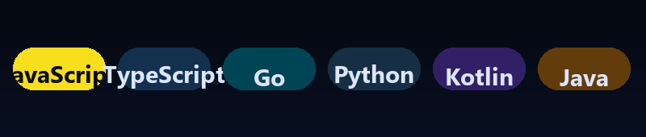
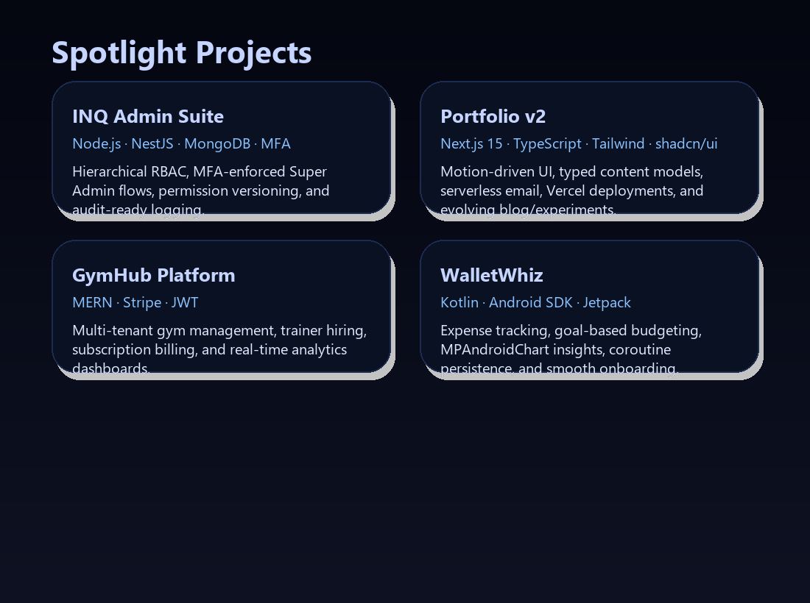
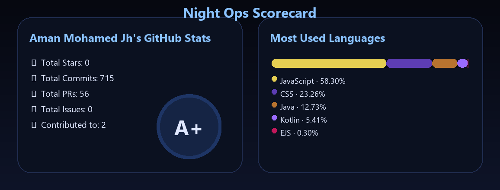
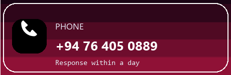
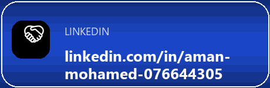

<table width="100%" cellspacing="0" cellpadding="18" style="border-radius:36px;background:linear-gradient(120deg,#050910 20%,#0d172c 70%,#04060b);border:1px solid #1d2942;box-shadow:0 25px 55px rgba(0,0,0,0.55);">
  <tr>
    <td width="64%" valign="top" style="padding-right:24px;">
      <h1 style="margin:0;color:#f3f6ff;font-size:2.3rem;">Aman Mohamed</h1>
      
SaaS Product Builder · Full-Stack & Backend Developer

      
Colombo, Sri Lanka · Shipping admin worlds, control rooms, and onboarding flows

      <ul style="margin:18px 0 0;padding-left:10px;list-style:none;color:#dfe4ff;font-size:0.95rem;">
        <li style="margin-bottom:10px;display:flex;gap:12px;align-items:flex-start;">
          
          

            <strong>Questline</strong> Crafting multi-tenant SaaS systems with Go backends, Next.js frontends, and research-driven UX.
          

        </li>
        <li style="margin-bottom:10px;display:flex;gap:12px;align-items:flex-start;">
          
          

            <strong>Specializations</strong>
            <ul style="margin:6px 0 0 14px;padding:0;">
              <li>Granular RBAC / MFA security loops</li>
              <li>Telemetry dashboards & growth experiments</li>
            </ul>
          

        </li>
        <li style="margin-bottom:10px;display:flex;gap:12px;align-items:flex-start;">
          
          

            <strong>Availability</strong> Internships · Contract builds · Remote pods (APAC friendly)
          

        </li>
      </ul>
      

        
        
        
        
        
      

    </td>
    <td width="36%" valign="top" style="border-left:1px solid #1d2942;padding-left:24px;">
      <h3 style="margin:0 0 12px;color:#b6c8ff;display:flex;align-items:center;gap:8px;">
        🛰️Status Console
      </h3>
      <table width="100%" cellpadding="8" style="background:#070d18;border-radius:18px;border:1px solid #1f2a44;">
        <tr>
          <td>⏱️ Timezone</td>
          <td align="right"><code>GMT+5:30</code></td>
        </tr>
        <tr>
          <td>🌘 Mode</td>
          <td align="right">Dark-first</td>
        </tr>
        <tr>
          <td>🎮 Playstyle</td>
          <td align="right">Remote / Hybrid</td>
        </tr>
        <tr>
          <td>🗣️ Speaks</td>
          <td align="right">EN · SI · TA</td>
        </tr>
      </table>
      <h4 style="margin:18px 0 8px;color:#b6c8ff;display:flex;align-items:center;gap:8px;">
        
        Signal Boosts
      </h4>
      <ul style="margin:0;padding-left:18px;color:#dfe4ff;font-size:0.92rem;">
        <li>Open-source obsessions: admin tooling, auth, telemetry</li>
        <li>Mentoring juniors on research + product loops</li>
      </ul>
    </td>
  </tr>
</table>

<h2 align="left">Hi 👋! My name is Aman Mohamed and I'm a SaaS-focused software engineer in training from Colombo, Sri Lanka.</h2>

###

  

  

  

  
  

### 🎮 Stack Loadout

The toolkit I keep hot-keyed for SaaS builds, control panels, and backend boss fights.

  

  
  
  
  
  
  

  
  
  
  
  
  

###

  
  
  
  
  

###

 

---

## 👋 About Me

<table width="100%" cellpadding="16" style="border:1px solid #1f2a44;border-radius:24px;background:#0c111e;">
  <tr>
    <td>
      
I’m a SLIIT BSc. (Software Engineering) undergraduate obsessed with crafting SaaS products that feel polished, reliable, and genuinely helpful. I love taking ideas from messy notes to production-ready experiences—balancing product thinking, research, and the engineering required to scale.

      <table width="100%" cellspacing="12" cellpadding="12">
        <tr>
          <td width="50%" valign="top" style="border:1px solid #1b2542;border-radius:16px;background:#111a2f;">
            <strong>🧠 Product Researcher</strong>
            
Onboarding, retention, and sustainable growth loops.

          </td>
          <td width="50%" valign="top" style="border:1px solid #1b2542;border-radius:16px;background:#111a2f;">
            <strong>🛠️ Full-Stack Engineer</strong>
            
Go backends, MERN/Next.js frontends, NestJS-powered APIs.

          </td>
        </tr>
        <tr>
          <td width="50%" valign="top" style="border:1px solid #1b2542;border-radius:16px;background:#111a2f;">
            <strong>⚙️ Security & Systems</strong>
            
Designing RBAC, MFA, observability, and clean auth flows.

          </td>
          <td width="50%" valign="top" style="border:1px solid #1b2542;border-radius:16px;background:#111a2f;">
            <strong>🤝 Builder Mindset</strong>
            
Open to internships, collaborations, and impactful volunteer work.

          </td>
        </tr>
      </table>
    </td>
  </tr>
</table>

---

## 🚀 What I’m Building

<table width="100%" cellspacing="18" cellpadding="0">
  <tr>
    <td width="50%" valign="top">
      <table width="100%" cellpadding="12" style="border:1px solid #1f2a44;border-radius:18px;background:#0d1424;">
        <tr>
          <td>
            

              <strong>INQ Admin Platform</strong>
              50% · Alpha
            

            
Enterprise-grade Super Admin/Admin system with MFA, granular permissions, detailed audit trails, and secure onboarding flows.

            
Stack: Node.js · NestJS · MongoDB · MFA

          </td>
        </tr>
      </table>
    </td>
    <td width="50%" valign="top">
      <table width="100%" cellpadding="12" style="border:1px solid #1f2a44;border-radius:18px;background:#0d1424;">
        <tr>
          <td>
            

              <strong>Portfolio v2</strong>
              Live
            

            
Next.js 15 + TypeScript rebuild with shadcn/ui, Framer Motion micro-interactions, typed content models, and Vercel CI/CD.

            
Stack: Next.js · TypeScript · Tailwind · shadcn/ui

          </td>
        </tr>
      </table>
    </td>
  </tr>
  <tr>
    <td width="50%" valign="top">
      <table width="100%" cellpadding="12" style="border:1px solid #1f2a44;border-radius:18px;background:#0d1424;">
        <tr>
          <td>
            

              <strong>GymHub (MERN + Stripe)</strong>
              Pilot
            

            
Centralized gym platform with JWT auth, trainer onboarding, analytics dashboards, and subscription billing via Stripe.

            
Stack: MongoDB · Express · React · Node · Stripe

          </td>
        </tr>
      </table>
    </td>
    <td width="50%" valign="top">
      <table width="100%" cellpadding="12" style="border:1px solid #1f2a44;border-radius:18px;background:#0d1424;">
        <tr>
          <td>
            

              <strong>WalletWhiz (Kotlin)</strong>
              Android
            

            
Native finance companion covering budgets, goal tracking, MPAndroidChart insights, coroutine-powered storage, and alerts.

            
Stack: Kotlin · Android SDK · Jetpack · MPAndroidChart

          </td>
        </tr>
      </table>
    </td>
  </tr>
</table>

---

## 🧰 Tech Focus

<table width="100%" border="0" cellspacing="12" cellpadding="0">
  <tr>
    <td width="50%" valign="top">
      <h4>💡 Programming & Languages</h4>
      

        
        
        
        
        
        
        
      

    </td>
    <td width="50%" valign="top">
      <h4>🧩 Frameworks & Platforms</h4>
      

        
        
        
        
        
        
        
      

    </td>
  </tr>
  <tr>
    <td width="50%" valign="top">
      <h4>⚙️ Backend & DevOps</h4>
      

        
        
        
        
        
        
        
      

    </td>
    <td width="50%" valign="top">
      <h4>🗄️ Data & Storage</h4>
      

        
        
        
        
        
        
      

    </td>
  </tr>
  <tr>
    <td colspan="2" valign="top">
      <h4>🚢 Product & Delivery</h4>
      

        
        
        
        
        
      

    </td>
  </tr>
</table>

---

## 🏫 Education

  

    
    <h4 style="margin:0;">SLIIT — BSc. (Hons) in Software Engineering</h4>
    
May 2023 – Aug 2027 · 3rd year · Basketball & Football · GPA tracking toward graduation.

  

  

    
    <h4 style="margin:0;">Zahira College Mawanella</h4>
    
STEM foundation, leadership, and club activities that kick-started the engineering journey.

  

---

## 🗂 Spotlight Projects

  

---

## 📊 GitHub Snapshot

  

  

### Night Ops Scorecard

  

---

## 🕹 Contribution Fun

  
   
  

---

## 🌱 Currently

  

Nightly ops board: what I’m queuing up, experimenting on, and shipping energy toward.

<table width="100%" cellspacing="12" cellpadding="0">
  <tr>
    <td width="50%" valign="top" style="border:1px solid #1f2a44;border-radius:18px;background:#0c121f;padding:16px;">
      
      <h4>🎒 Mission Queue</h4>
      
Scanning for SaaS pods and software engineering squads that thrive on dark-mode dashboards and rapid iterations.

      <ul>
        <li>Internships, contract builds, or remote collabs across Sri Lanka</li>
        <li>Prefer teams crafting ops platforms, admin tooling, or growth infra</li>
      </ul>
    </td>
    <td width="50%" valign="top" style="border:1px solid #1f2a44;border-radius:18px;background:#0c121f;padding:16px;">
      
      <h4>📘 Deep Practice</h4>
      
Daily reps on scalable Go services, telemetry-first APIs, and SaaS growth loops that feel like game economies.

      <ul>
        <li>Designing service meshes + tracing like boss-fights</li>
        <li>Breaking down permission trees & experimentation loops</li>
      </ul>
    </td>
  </tr>
  <tr>
    <td width="50%" valign="top" style="border:1px solid #1f2a44;border-radius:18px;background:#0c121f;padding:16px;">
      
      <h4>🧪 Lab Experiments</h4>
      
Personal R&amp;D on session revocation, multi-tenant analytics, and onboarding rituals that respect humans.

      <ul>
        <li>Rapid protos in Next.js + Go + Supabase stacks</li>
        <li>Telemetry dashboards that pulse like synthwave HUDs</li>
      </ul>
    </td>
    <td width="50%" valign="top" style="border:1px solid #1f2a44;border-radius:18px;background:#0c121f;padding:16px;">
      
      <h4>🤲 Community Boost</h4>
      
Volunteering invoker mode: education, civic tech, sustainability, and economic empowerment projects.

      <ul>
        <li>Mentoring cohorts on product thinking + research</li>
        <li>Pro-bono dashboards for grassroots orgs</li>
      </ul>
    </td>
  </tr>
</table>

---

## 🌐 Languages & Communication

| Language  | Fluency Level                 | Collaboration Style                               |
| --------- | ----------------------------- | ------------------------------------------------- |
| English   | Full professional proficiency | Clear async/real-time updates, stakeholder-facing |
| Sinhalese | Full professional proficiency | Cross-functional teaming, local community work    |
| Tamil     | Native / bilingual            | Mentoring, community outreach, documentation      |

Comfortable toggling between async docs, live demos, and stakeholder briefings across diverse teams.

---

## 🤝 Let’s Connect

|                   |                                          |
| ------------------------------------------------------------------------------------------------- | -------------------------------------------------------------------------------------------------------- |
|                                            |  |
|  | &nbsp;                                                                                                   |

Let’s collaborate on something worth shipping.

